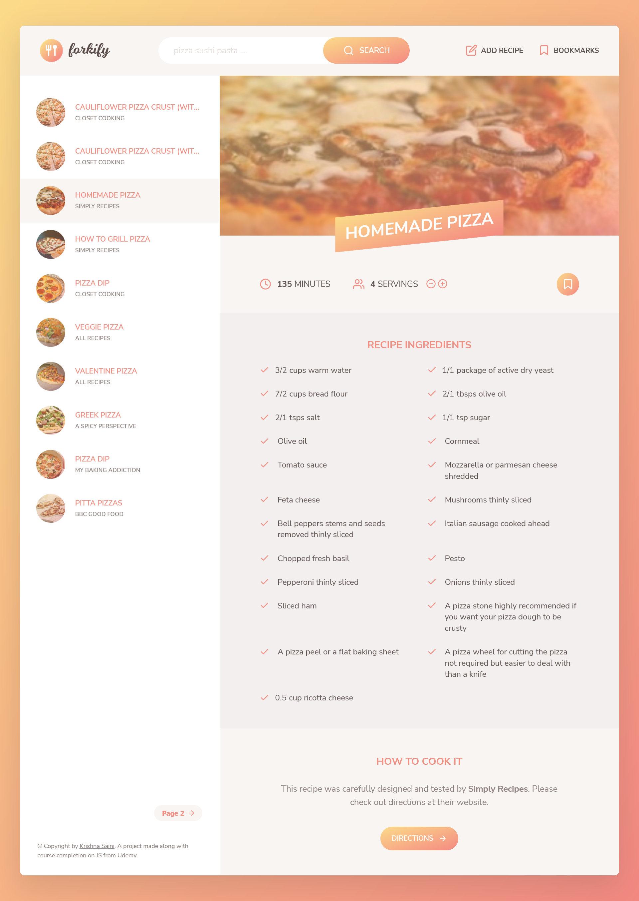

#forkify 

It is a recipe search application with custom recipe upload option. It is made as a final assignment of a [udemy](https://www.udemy.com/course/the-complete-javascript-course/) course.

## Table of contents

- [Overview](#overview)
  - [Features](#features)
  - [Links](#links)
- [My process](#my-process)
  - [Built with](#built-with)
  - [What I learned](#what-i-learned)
  - [Useful resources](#useful-resources)
- [Author](#author)
- [Acknowledgments](#acknowledgments)
- [Screenshot](#screenshot)
  
  
  
## Overview

### Features

- search recipe using API -  'https://forkify-api.herokuapp.com/api/v2/recipes/';
- rendering search results using pagination
- Add your own recipes 
- Add bookmark to favorite recipe

### Links
-  [Solution URL](https://github.com/krishna-saini/forkify)
-  [Live Site URL](https://forkify-krishna-saini.netlify.app/)

## My process

### Built with

- Vanilla Javascript
- Based on Model-View-Controller (MVC) architecture
- Mobile-first workflow using tailwind CSS
- API functionality is handled using await & async feature of JS
- Modules
- SASS for styling

### What I learned
- I gained indepth understanding of MVC architecuture. This project is using publisher subscriber design pattern to establish connection between various components of MVC architecture. 
- I also learned various functionalities related to API such has get/post request, errot handling etc.
- I learned about npm packages like webpack, babel etc.
- I learned how to write modular and optimized scripts.

### Useful resources

- [Learn Code Online](https://web.learncodeonline.in/) - This helped me in learning fundamentals of tailwind css.
- [CSS udemy course](https://www.udemy.com/course/the-complete-javascript-course/) - This helped in learning HTML5 semantic markup, various CSS properties, in writing clean code, adding comments, structing folder etc.
- [JS udemy course](https://www.udemy.com/course/the-complete-javascript-course/)

## Author
- Name: Krishna Saini
- [Website](https://krishna-saini.netlify.app/)
-  [Linkedin](https://www.linkedin.com/in/krishna-saini-39b4126a/)
- [github](https://github.com/krishna-saini)

## Acknowledgments
I would like to thanks [Jonas Schmedtmann](https://github.com/jonasschmedtmann) for creating such a wonderful course on Javascript as well as CSS.

## Screenshot

